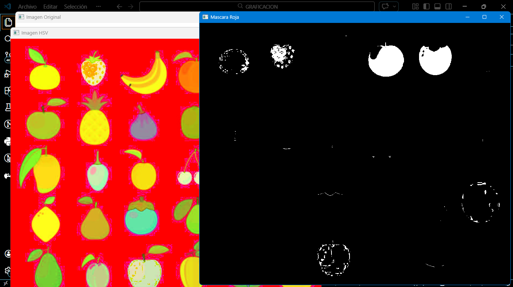

# Actividad 1: Exploracion del Espacio HSV
---

# 1. Introducción

La segmentación de imágenes es uno de los procesos más importantes dentro del área de visión por computadora. Este proceso consiste en dividir una imagen en regiones que comparten características similares, como color, textura o intensidad.

En esta práctica se implementa un sistema de segmentación basado en color utilizando el espacio de color HSV. Este modelo permite separar la información de color de la iluminación, lo que facilita la identificación de objetos dentro de una imagen.

La práctica se desarrolla utilizando Python y las bibliotecas NumPy y OpenCV, las cuales permiten realizar operaciones matemáticas sobre matrices de píxeles y visualizar los resultados.

---

# 2. Objetivo

Desarrollar un programa en Python que permita detectar frutas dentro de una imagen utilizando segmentación basada en el espacio de color HSV, aplicando técnicas de filtrado morfológico y análisis de regiones conectadas.

---

# 3. Codigo

El siguiente código implementa todas las etapas del algoritmo.

```python

# Importar librerías
import cv2 as cv
import numpy as np

# Cargar imagen
img = cv.imread("frutas.png")

if img is None:
    print("Error al cargar la imagen")
    exit()

# Convertir imagen a HSV
hsv = cv.cvtColor(img, cv.COLOR_BGR2HSV)

# Definir rangos de colores
colores = {

"rojo": ([0,120,70],[10,255,255]),
"verde": ([35,80,80],[85,255,255]),
"amarillo": ([20,100,100],[30,255,255])

}

# Kernel para operaciones morfológicas
kernel = np.ones((5,5), np.uint8)

# Procesar cada color
for nombre,(lower,upper) in colores.items():
    lower = np.array(lower)
    upper = np.array(upper)
    mask = cv.inRange(hsv, lower, upper)
    mask_limpia = cv.morphologyEx(mask, cv.MORPH_OPEN, kernel)
    num_labels, labels, stats, centroids = cv.connectedComponentsWithStats(mask_limpia)
    contador = 0
    for i in range(1, num_labels):
        area = stats[i, cv.CC_STAT_AREA]
        if area > 500:
            contador += 1
    print("Color:", nombre)
    print("Frutas detectadas:", contador)
    print("-----------------------------")
    cv.imshow("Mascara " + nombre, mask_limpia)

cv.imshow("Imagen Original", img)

cv.waitKey(0)
cv.destroyAllWindows()
```

---

# 4. Resultados

Al ejecutar el programa se observarán:
Ventana con la imagen original.
Ventanas con las máscaras de cada color.
Salida en la consola mostrando el número de frutas detectadas.

Ejemplo:
Color: rojo
Frutas detectadas: 7
Color: verde
Frutas detectadas: 8
Color: amarillo
Frutas detectadas: 6


---

# 5. Análisis

La segmentación por color permite identificar objetos de manera eficiente cuando estos poseen colores claramente definidos.

Durante el desarrollo de la práctica se observó que:

* rangos muy estrechos provocan pérdida de información
* rangos muy amplios generan ruido
* las operaciones morfológicas mejoran significativamente la calidad de la máscara

Además, se comprobó que el conteo de regiones conectadas permite identificar objetos sin necesidad de analizar directamente la imagen original.

---

# 6. Conclusión

La segmentación de imágenes utilizando el modelo HSV representa una técnica eficiente para detectar objetos basados en su color. En esta práctica se comprobó que la separación entre color e iluminación permite obtener resultados más estables en comparación con otros modelos de color.

El uso de operaciones morfológicas resulta fundamental para eliminar ruido antes de realizar el análisis de regiones conectadas. Asimismo, el algoritmo de componentes conectados facilita el conteo de objetos dentro de una imagen binaria.

Sin embargo, este método presenta limitaciones cuando los objetos poseen colores similares o cuando las condiciones de iluminación varían considerablemente. Por esta razón, en aplicaciones más avanzadas se combinan múltiples técnicas de visión por computadora para mejorar la precisión del sistema.
