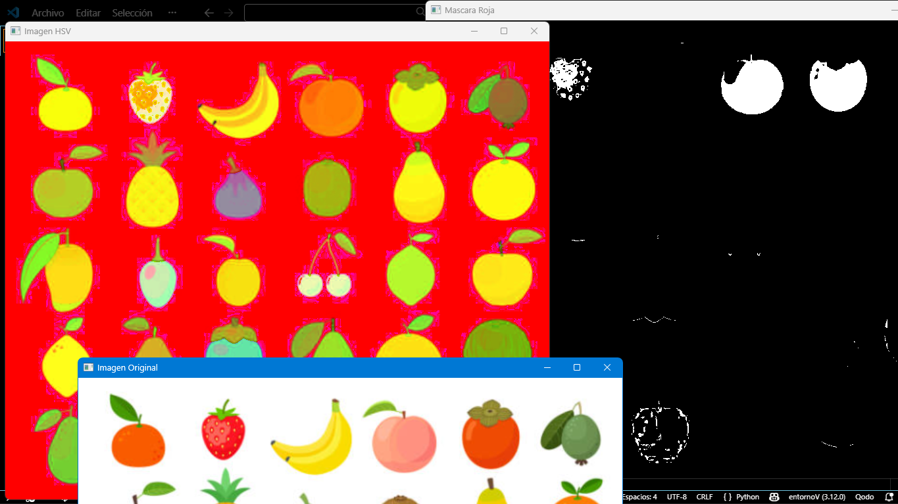

# Actividad 1: Exploracion del Espacio HSV
---

# 1. Introducción
La segmentación de imágenes es uno de los procesos más importantes dentro del área de visión por computadora. Este proceso consiste en dividir una imagen en regiones que comparten características similares, como color, textura o intensidad.

En esta práctica se implementa un sistema de segmentación basado en color utilizando el espacio de color HSV. Este modelo permite separar la información de color de la iluminación, lo que facilita la identificación de objetos dentro de una imagen.

La práctica se desarrolla utilizando Python y las bibliotecas NumPy y OpenCV, las cuales permiten realizar operaciones matemáticas sobre matrices de píxeles y visualizar los resultados.

---

# 2. Objetivo
Explorar el espacio de color HSV y ajustar rangos de color para segmentar frutas dentro de una imagen utilizando OpenCV.

---

# 3. Codigo
El siguiente código implementa todas las etapas del algoritmo.

```python

# Importar librerías
import cv2
import numpy as np

# cargar imagen
img = cv2.imread("C:\\Users\\Asus\\OneDrive\\Documentos\\GRAFICACION\\TareasGrafi\\frutas.png")

# convertir a HSV
hsv = cv2.cvtColor(img, cv2.COLOR_BGR2HSV)

# rango HSV para color rojo
lower_red = np.array([0,120,70])
upper_red = np.array([10,255,255])

# crear mascara para color rojo
mask_red = cv2.inRange(hsv, lower_red, upper_red)

# mostrar resultados
cv2.imshow("Imagen Original", img)
cv2.imshow("Imagen HSV", hsv)
cv2.imshow("Mascara Roja", mask_red)

# Esperar hasta que se presione una tecla
cv2.waitKey(0)
# Cerar ventanas
cv2.destroyAllWindows()
```

---

# 4. Resultados
Durante la ejecución del programa se deben guardar las siguientes capturas:
Imagen original.
Imagen convertida al espacio HSV.
Máscara obtenida después de aplicar el rango de color.
Estas imágenes permiten observar cómo se realiza el proceso de segmentación basado en color.

---

# 5. Análisis
¿Qué ocurre cuando el rango es muy estrecho?
Cuando el rango de valores HSV es demasiado estrecho, la máscara solo detecta una pequeña parte de los objetos que poseen ese color. Esto provoca que algunas frutas no sean detectadas completamente o que aparezcan fragmentadas dentro de la máscara.

En otras palabras, el sistema se vuelve demasiado estricto y únicamente detecta píxeles con valores muy específicos, ignorando pequeñas variaciones de color presentes en los objetos.


¿Qué ocurre cuando el rango es muy amplio?
Cuando el rango HSV es demasiado amplio, la máscara comienza a detectar píxeles que no pertenecen realmente a las frutas del color seleccionado. Esto provoca la aparición de ruido dentro de la máscara y puede generar detecciones incorrectas.

Un rango demasiado amplio reduce la precisión del algoritmo, ya que incluye colores similares que pueden pertenecer al fondo u otros objetos dentro de la imagen.

---

# 6. Conclusión

El espacio de color HSV permite realizar segmentación de imágenes de forma más eficiente que otros modelos de color, ya que separa la información de color de la iluminación.

Durante la exploración realizada en esta actividad se observó que la selección adecuada de los rangos HSV es fundamental para obtener una segmentación correcta.

Un rango demasiado estrecho provoca pérdida de información, mientras que un rango demasiado amplio genera ruido en la máscara.

Por esta razón, el ajuste de los rangos de color es una etapa clave en los sistemas de visión por computadora que utilizan segmentación basada en color.
