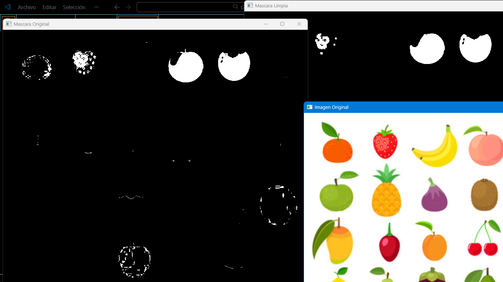

# Actividad 2: Limpieza de Ruido
---

# 1. Introducción
Durante el proceso de segmentación de imágenes es común que aparezcan pequeñas regiones que no pertenecen realmente a los objetos que se desean detectar. Estas regiones son conocidas como ruido y pueden afectar negativamente el análisis posterior de la imagen.

El ruido puede aparecer debido a diversos factores como variaciones de iluminación, imperfecciones del sensor de la cámara o similitudes entre colores dentro de la imagen.

Para reducir este problema se utilizan técnicas de procesamiento morfológico que permiten eliminar pequeños fragmentos de píxeles que no forman parte de los objetos principales.
En esta actividad se aplicará una operación morfológica conocida como apertura, la cual permite limpiar la máscara generada durante la segmentación de color.

---

# 2. Objetivo
Analizar el ruido presente en una máscara binaria generada a partir de segmentación por color y aplicar operaciones morfológicas para mejorar la calidad de la máscara antes de realizar el conteo de objetos.

---

# 3. Codigo

El siguiente código realiza el proceso de generación de la máscara y posteriormente aplica una operación morfológica para eliminar el ruido presente en la imagen.

```python
# Importar librerías
import cv2 as cv
import numpy as np

# Cargar imagen
img = cv.imread("frutas.png")

if img is None:
    print("Error al cargar la imagen")
    exit()

# Convertir imagen a HSV
hsv = cv.cvtColor(img, cv.COLOR_BGR2HSV)

# Definir rango de color rojo
lower_red = np.array([0,120,70])
upper_red = np.array([10,255,255])

# Crear máscara binaria
mask = cv.inRange(hsv, lower_red, upper_red)

# Crear kernel para operaciones morfológicas
kernel = np.ones((5,5), np.uint8)

# Aplicar operación de apertura para eliminar ruido
mask_limpia = cv.morphologyEx(mask, cv.MORPH_OPEN, kernel)

# Mostrar resultados
cv.imshow("Mascara Original", mask)
cv.imshow("Mascara Limpia", mask_limpia)
cv.imshow("Imagen Original", img)

cv.waitKey(0)
cv.destroyAllWindows()
```
---

# 4. Resultados
Al ejecutar el programa se muestran tres ventanas:
Imagen original.
Máscara generada sin aplicar limpieza.
Máscara después de aplicar la operación morfológica.
En la máscara inicial es posible observar pequeños puntos blancos que no corresponden a frutas reales. Después de aplicar la operación de apertura, estas regiones pequeñas desaparecen y las frutas quedan mejor definidas dentro de la máscara.

---

# 5. Análisis
¿Qué tipo de ruido aparece?
El ruido que aparece en la máscara corresponde principalmente a pequeños puntos o regiones blancas aisladas que no pertenecen realmente a las frutas. Estas regiones se generan debido a variaciones de color en la imagen o a similitudes entre los colores del fondo y el rango HSV seleccionado.

Este tipo de ruido suele conocerse como ruido de píxeles aislados o ruido de segmentación.

¿Por qué es necesario eliminarlo antes del conteo?
Es necesario eliminar el ruido antes del conteo porque estas pequeñas regiones podrían ser interpretadas como objetos adicionales por el algoritmo de detección.

Si el ruido no se elimina, el sistema podría contar objetos inexistentes, generando resultados incorrectos. Las operaciones morfológicas permiten limpiar la máscara y asegurar que únicamente se analicen las regiones que realmente corresponden a frutas dentro de la imagen.

---

# 6. Conclusión
La limpieza de ruido es un paso fundamental dentro del procesamiento de imágenes. La aplicación de operaciones morfológicas como la apertura permite eliminar pequeñas regiones no deseadas que aparecen durante la segmentación por color.

Al mejorar la calidad de la máscara, se obtiene un análisis más preciso durante etapas posteriores como la detección y conteo de objetos dentro de la imagen.