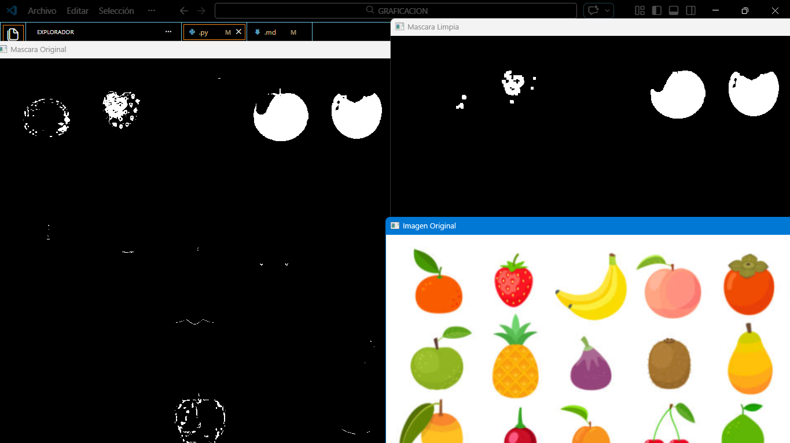

# Actividad 2: Limpieza de Ruido
---

# 1. Introducción
Durante el proceso de segmentación de imágenes es común que aparezcan pequeñas regiones que no pertenecen realmente a los objetos que se desean detectar. Estas regiones son conocidas como ruido y pueden afectar negativamente el análisis posterior de la imagen.

El ruido puede aparecer debido a diversos factores como variaciones de iluminación, imperfecciones del sensor de la cámara o similitudes entre colores dentro de la imagen.

Para reducir este problema se utilizan técnicas de procesamiento morfológico que permiten eliminar pequeños fragmentos de píxeles que no forman parte de los objetos principales.
En esta actividad se aplicará una operación morfológica conocida como apertura, la cual permite limpiar la máscara generada durante la segmentación de color.

---

# 2. Objetivo
Analizar el ruido presente en una máscara binaria generada a partir de segmentación por color y aplicar operaciones morfológicas para mejorar la calidad de la máscara antes de realizar el conteo de objetos.

---

# 3. Codigo

El siguiente código realiza el proceso de generación de la máscara y posteriormente aplica una operación morfológica para eliminar el ruido presente en la imagen.

```python
# Importar librerías
import cv2 as cv
import numpy as np

# Cargar imagen
img = cv.imread("frutas.png")

if img is None:
    print("Error al cargar la imagen")
    exit()

# Convertir imagen a HSV
hsv = cv.cvtColor(img, cv.COLOR_BGR2HSV)

# Definir rango de color rojo
lower_red = np.array([0,120,70])
upper_red = np.array([10,255,255])

# Crear máscara binaria
mask = cv.inRange(hsv, lower_red, upper_red)

# Crear kernel para operaciones morfológicas
kernel = np.ones((5,5), np.uint8)

# Aplicar operación de apertura para eliminar ruido
mask_limpia = cv.morphologyEx(mask, cv.MORPH_OPEN, kernel)

# Mostrar resultados
cv.imshow("Mascara Original", mask)
cv.imshow("Mascara Limpia", mask_limpia)

cv.imshow("Imagen Original", img)

cv.waitKey(0)
cv.destroyAllWindows()
```
---

# 4. Resultados
Al ejecutar el programa se observarán:
Ventana con la imagen original.
Ventana con la máscara generada mediante segmentación de color.
Ventana con la máscara después de aplicar la limpieza de ruido.
La máscara limpia presenta menos puntos blancos aislados y mantiene únicamente las regiones principales correspondientes a las frutas detectadas.

---

# 5. Análisis
Durante el análisis de la máscara original se pueden observar pequeños puntos blancos que no corresponden a frutas reales. Estos puntos son considerados ruido dentro del proceso de segmentación.

Después de aplicar la operación morfológica de apertura se eliminan muchas de estas pequeñas regiones, permitiendo que la máscara represente de forma más precisa los objetos reales presentes en la imagen.
Este paso es fundamental antes de realizar procesos como el conteo de objetos, ya que el ruido podría provocar que el sistema detecte más objetos de los que realmente existen.

---

# 6. Conclusión
La limpieza de ruido es una etapa fundamental dentro del procesamiento digital de imágenes, especialmente cuando se trabaja con segmentación por color.

Las operaciones morfológicas permiten mejorar significativamente la calidad de las máscaras binarias eliminando pequeñas regiones que no pertenecen a los objetos de interés.
Gracias a este proceso es posible obtener resultados más confiables al momento de realizar análisis posteriores como detección de objetos o conteo de regiones conectadas.

Sin la aplicación de estas técnicas, los algoritmos de visión por computadora podrían generar resultados incorrectos debido a la presencia de ruido dentro de la imagen.