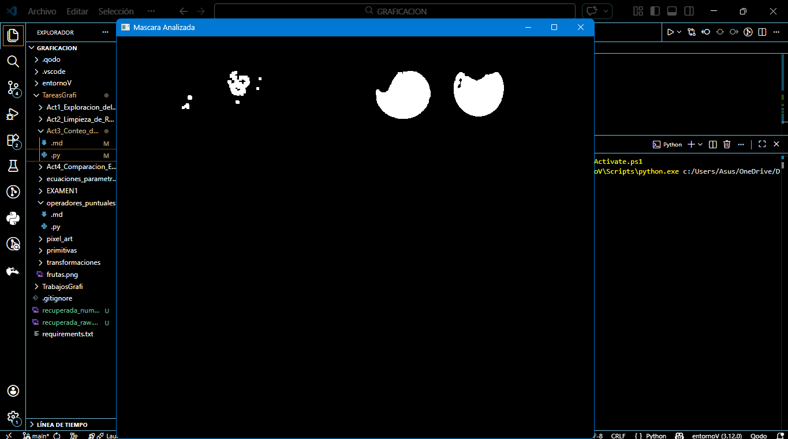

# Actividad 3: Conteo de Regiones
---

# 1. Introducción
En el procesamiento digital de imágenes, después de realizar la segmentación de una imagen es posible analizar las regiones presentes dentro de la máscara obtenida.

Una región conectada corresponde a un conjunto de píxeles que comparten características similares y que además están conectados entre sí. En imágenes binarias, estas regiones suelen representar objetos dentro de la escena.

El análisis de componentes conectados permite identificar automáticamente cada región dentro de una máscara binaria y obtener información importante sobre ellas, como su tamaño o área.

En esta actividad se analizará la máscara obtenida mediante segmentación por color para identificar cuántas frutas existen dentro de la imagen y calcular el área aproximada de cada región detectada.

---

# 2. Objetivo
Detectar y analizar las regiones conectadas dentro de una máscara binaria para determinar el número total de frutas presentes y calcular el área aproximada de cada región válida.
---

# 3. Codigo

El siguiente código genera una máscara basada en el color rojo, aplica limpieza para eliminar ruido y posteriormente detecta las regiones conectadas para realizar el conteo de frutas.

```python
import cv2 
import numpy as np

# Cargar imagen
img = cv2.imread("C:\\Users\\Asus\\OneDrive\\Documentos\\GRAFICACION\\TareasGrafi\\frutas.png")

if img is None:
    print("Error al cargar la imagen")
    exit()

# Convertir a HSV
hsv = cv2.cvtColor(img, cv2.COLOR_BGR2HSV)

# Rango para frutas rojas
lower_red = np.array([0,120,70])
upper_red = np.array([10,255,255])

# Crear máscara
mask = cv.inRange(hsv, lower_red, upper_red)

# Kernel para limpieza
kernel = np.ones((5,5), np.uint8)

# Limpiar ruido
mask_limpia = cv2.morphologyEx(mask, cv2.MORPH_OPEN, kernel)

# Detectar componentes conectados
num_labels, labels, stats, centroids = cv2.connectedComponentsWithStats(mask_limpia)

contador = 0

print("Analisis de regiones detectadas")
print("--------------------------------")

# Analizar regiones
for i in range(1, num_labels):

    area = stats[i, cv2.CC_STAT_AREA]

    # Filtrar regiones pequeñas
    if area > 500:
        contador += 1
        print("Region", contador)
        print("Area aproximada:", area)
        print("----------------")

print("Numero total de frutas detectadas:", contador)

# Mostrar únicamente la máscara
cv2.imshow("Mascara Analizada", mask_limpia)

cv2.waitKey(0)
cv2.destroyAllWindows()
```
---

# 4. Resultados
Al ejecutar el programa se realiza el siguiente proceso:
Region 1
Area aproximada: 1004

Region 2
Area aproximada: 5644

Region 3
Area aproximada: 5160

Numero total de frutas detectadas: 3

La ventana mostrada corresponde únicamente a la máscara utilizada para realizar el análisis.


---

# 5. Análisis
El análisis se realiza únicamente sobre la máscara binaria generada durante el proceso de segmentación.

Cada región blanca dentro de la máscara representa una posible fruta detectada. El algoritmo de componentes conectados permite identificar estas regiones y calcular propiedades importantes como el área.

Durante el análisis se observa que algunas regiones pequeñas pueden aparecer debido a ruido generado durante la segmentación. Por esta razón se establece un umbral mínimo de área para eliminar estas regiones y evitar conteos incorrectos.

Este proceso permite obtener un conteo más preciso de las frutas presentes dentro de la imagen.

---

# 6. Conclusión
El análisis de regiones conectadas es una técnica fundamental dentro del procesamiento digital de imágenes, ya que permite identificar y analizar objetos dentro de una máscara binaria.

En esta actividad se comprobó que es posible detectar y contar frutas dentro de una imagen utilizando únicamente la información presente en la máscara segmentada.

La aplicación de un filtro basado en el área permite eliminar regiones pequeñas que corresponden a ruido, mejorando la precisión del conteo.