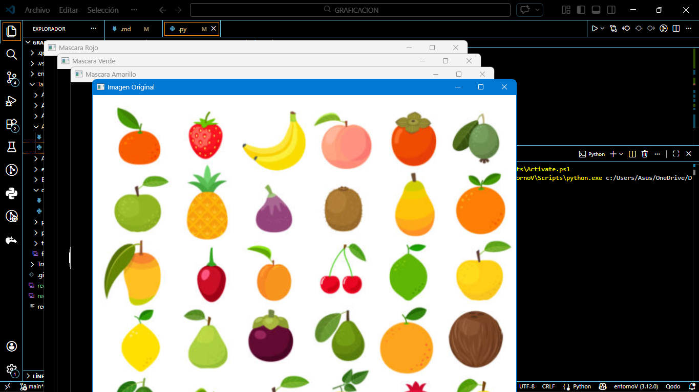
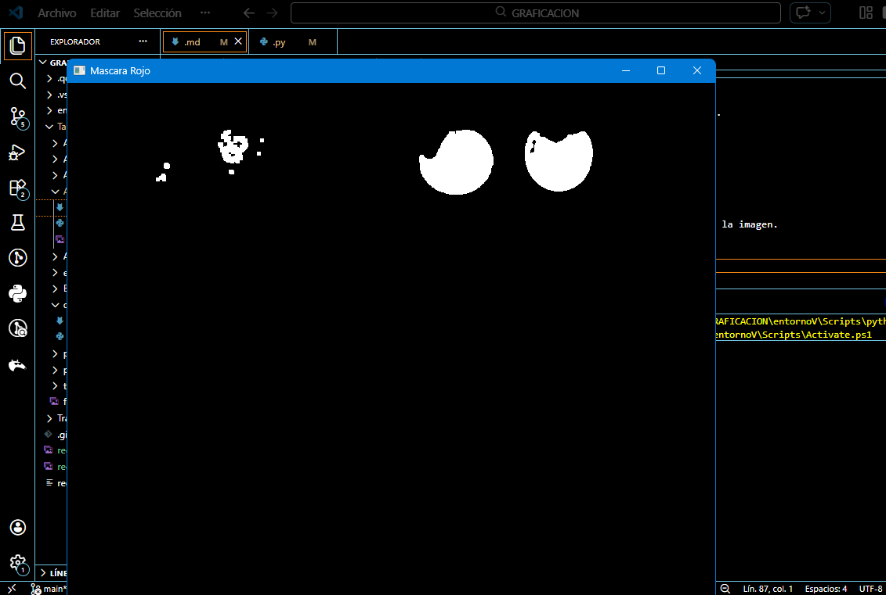
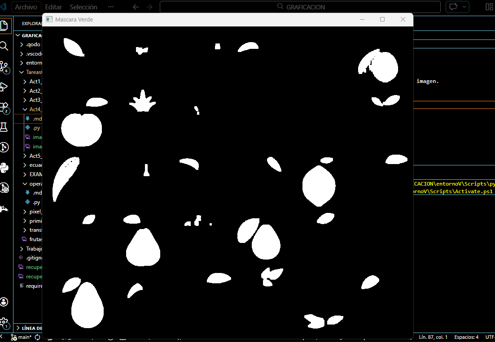
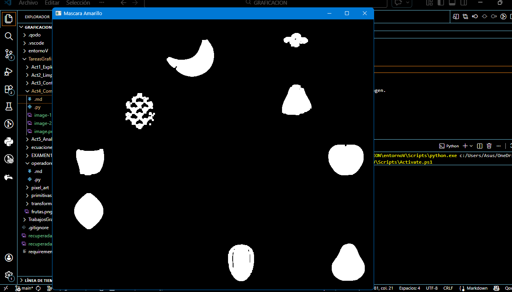

# Actividad 4: Comparación Entre Colores
---

# 1. Introducción
En el procesamiento digital de imágenes, la segmentación basada en color permite identificar objetos dentro de una imagen utilizando características cromáticas específicas. Sin embargo, no todos los colores se comportan de la misma manera durante el proceso de segmentación.

Factores como la iluminación, la saturación del color y el contraste con el fondo pueden afectar la calidad de la máscara obtenida. Algunos colores pueden segmentarse con mayor facilidad, mientras que otros pueden generar mayor cantidad de ruido.

En esta actividad se repetirá el proceso de segmentación para tres colores diferentes: rojo, verde y amarillo. Posteriormente se compararán los resultados obtenidos para analizar cuál color es más fácil de detectar y cuál presenta mayor ruido.
---

# 2. Objetivo
Comparar la segmentación de diferentes colores dentro de una imagen utilizando el espacio de color HSV y analizar las diferencias en la detección de frutas para cada caso.
---

# 3. Codigo
El siguiente código realiza el proceso completo de segmentación, limpieza de ruido y conteo de regiones para tres colores diferentes.

```python
import cv2 
import numpy as np

# Cargar imagen
img = cv2.imread("C:\\Users\\Asus\\OneDrive\\Documentos\\GRAFICACION\\TareasGrafi\\frutas.png")
if img is None:
    print("Error al cargar la imagen")
    exit()

# Convertir a HSV
hsv = cv2.cvtColor(img, cv2.COLOR_BGR2HSV)

# Definir rangos HSV para cada color
colores = {
"Rojo": ([0,120,70], [10,255,255]),
"Verde": ([35,80,80], [85,255,255]),
"Amarillo": ([20,100,100], [30,255,255])
}

# Kernel para limpieza
kernel = np.ones((5,5), np.uint8)
print("Analisis por color")
print("---------------------------")
for nombre,(lower,upper) in colores.items():
    lower = np.array(lower)
    upper = np.array(upper)

    # Crear máscara
    mask = cv2.inRange(hsv, lower, upper)

    # Limpiar ruido
    mask_limpia = cv2.morphologyEx(mask, cv2.MORPH_OPEN, kernel)

    # Detectar regiones conectadas
    num_labels, labels, stats, centroids = cv2.connectedComponentsWithStats(mask_limpia)
    contador = 0
    for i in range(1, num_labels):
        area = stats[i, cv2.CC_STAT_AREA]

        # Filtrar regiones pequeñas
        if area > 500:
            contador += 1

    print("Color:", nombre)
    print("Frutas detectadas:", contador)
    print("---------------------------")
    cv2.imshow("Mascara " + nombre, mask_limpia)

cv2.imshow("Imagen Original", img)

cv2.waitKey(0)
cv2.destroyAllWindows()
```
---

# 4. Resultados
Después de ejecutar el programa se obtiene el número de frutas detectadas para cada color.

Ejemplo de resultados obtenidos:
|  Color   | Número Detectado |     Observaciones     |
|  Rojo	   |       3	      |  Buena segmentación   |
|  Verde   |       6	      | Segmentación estable  |
| Amarillo |  	   9	      | Aparece algo de ruido |

Las máscaras generadas permiten observar qué regiones corresponden a cada color dentro de la imagen.





---

# 5. Reflexión
¿Qué color fue más fácil segmentar?
El color verde fue el más fácil de segmentar, ya que presenta una separación clara dentro del espacio HSV y un contraste adecuado con otros elementos presentes en la imagen. Esto permite que el rango HSV detecte las frutas verdes de manera más consistente.

¿Cuál presentó más ruido?
El color amarillo presentó mayor cantidad de ruido durante la segmentación. Esto ocurre porque algunos objetos dentro de la imagen poseen tonos similares al amarillo, lo que provoca que la máscara detecte regiones adicionales que no corresponden realmente a frutas.

¿Por qué ocurre esto?
Esto ocurre porque el rango de valores HSV para ciertos colores puede coincidir con otros elementos dentro de la imagen. Cuando esto sucede, el algoritmo de segmentación detecta píxeles que no pertenecen realmente al objeto de interés, generando ruido dentro de la máscara.

---

# 6. Conclusión
La segmentación basada en color utilizando el espacio HSV permite detectar objetos dentro de una imagen de forma eficiente. Sin embargo, la precisión del método depende del color seleccionado y de las condiciones de iluminación presentes en la escena.

En esta práctica se comprobó que algunos colores se segmentan con mayor facilidad que otros debido a su contraste con el fondo y a la distribución de tonos dentro de la imagen.