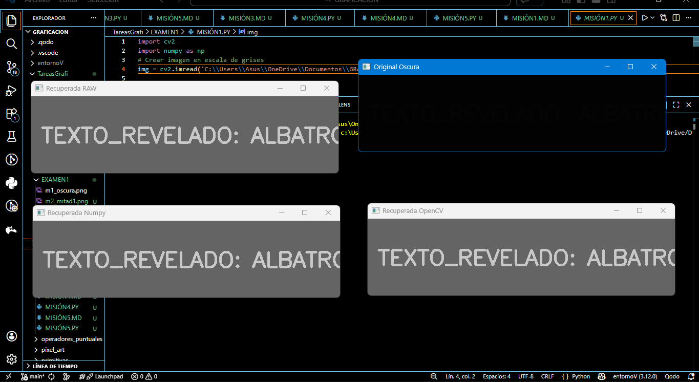

# Misión 1: El Mensaje Subexpuesto
---

# 1. Introducción
Se interceptó una imagen oscura que contiene un mensaje oculto. El enemigo aplicó una operación puntual para dividir los valores de los píxeles entre 50, haciendo que la imagen pareciera completamente negra.

---

# 2. Objetivo
Recuperar la información oculta en la imagen utilizando operadores puntuales y técnicas de procesamiento con OpenCV y NumPy.

---

# 3. Codigo
```python

import cv2
import numpy as np

img = cv2.imread('C:\\Users\\Asus\\OneDrive\\Documentos\\GRAFICACION\\TareasGrafi\\EXAMEN1\\m1_oscura.png', cv2.IMREAD_GRAYSCALE)

# Método RAW
recuperada_raw = np.zeros_like(img)
for i in range(img.shape[0]):
    for j in range(img.shape[1]):
        valor = img[i,j] * 50
        recuperada_raw[i,j] = np.clip(valor, 0, 255)

# Método Vectorizado
recuperada_numpy = np.clip(img * 50, 0, 255).astype(np.uint8)

cv2.imwrite("recuperada_raw.png", recuperada_raw)
cv2.imwrite("recuperada_numpy.png", recuperada_numpy)
```

---

# 4. Resultados
La imagen recuperada revela el mensaje oculto en tonos claros.

---

# 5. Análisis
El método RAW permite entender el proceso píxel por píxel, mientras que el vectorizado es más eficiente para imágenes grandes.
---

# 6. Conclusión
Ambos métodos cumplen el objetivo, pero en aplicaciones reales se prefiere el vectorizado por su rapidez.