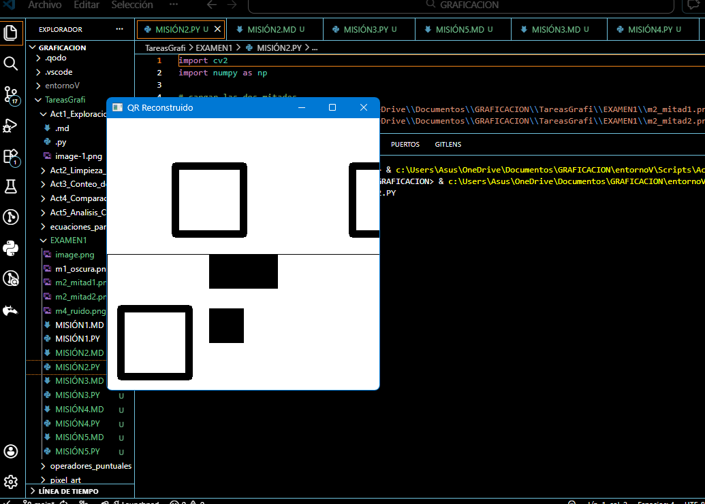

# Misión 2: El QR Fragmentado
---

# 1. Introducción
Un código QR fue dividido en dos mitades y alterado para impedir su lectura. La mitad superior fue desplazada y la inferior rotada 180°.

---

# 2. Objetivo
Aplicar transformaciones geométricas (traslación y rotación) para reconstruir el QR en un lienzo de 400x400 píxeles.
---

# 3. Codigo
```python

import cv2
import numpy as np

# cargar las dos mitades
mitad1 = cv2.imread('C:\\Users\\Asus\\OneDrive\\Documentos\\GRAFICACION\\TareasGrafi\\EXAMEN1\\m2_mitad1.png')
mitad2 = cv2.imread('C:\\Users\\Asus\\OneDrive\\Documentos\\GRAFICACION\\TareasGrafi\\EXAMEN1\\m2_mitad2.png') 

# Verificar que las imágenes se han cargado correctamente
if mitad1 is None or mitad2 is None:
    print("Error al cargar las imágenes")
    exit()

    # crear lienzo en blanco de 400x400
lienzo = np.zeros((400, 400, 3), dtype=np.uint8)

#  1.- TRASLACIÓN DE LA MITAD SUPERIOR
#matriz de traslación: mover al origen (0,0)
M_traslacion = np.float32([[1, 0, -0], [0, 1,0]])
mitad1_corr = cv2.warpAffine(mitad1, M_traslacion, (400, 200))  

# pegar la mitad superior en el lienzo
lienzo[0:200, 0:400] = mitad1_corr

# 2.- ROTACIÓN DE LA MITAD INFERIOR
# rotar 180° sobre su centro
filas, columnas = mitad2.shape[:2]
M_rotacion = cv2.getRotationMatrix2D((columnas/2, filas/2), 180, 1)
mitad2_corr = cv2.warpAffine(mitad2, M_rotacion, (columnas, filas))

# pegar la mitad inferior en el lienzo
lienzo[200:400, 0:400] = mitad2_corr    

# mostrar resultado
cv2.imshow("QR Reconstruido", lienzo)
cv2.waitKey(0)
cv2.destroyAllWindows()

# guardar en el  disco
cv2.imwrite("QR_Reconstruido.png", lienzo)
```

---

# 4. Resultados
El QR reconstruido puede ser escaneado correctamente.

---

# 5. Análisis
La combinación de traslación y rotación permite recuperar la geometría original del QR.
---

# 6. Conclusión
Las transformaciones geométricas son esenciales para corregir imágenes alteradas.