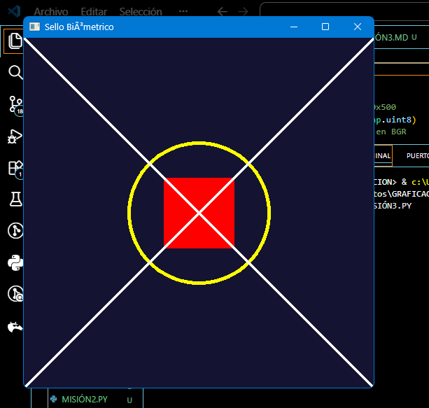

# Misión 3: El Sello Biométrico
---

# 1. Introducción
Se requiere un sello geométrico exacto para abrir el servidor. Las instrucciones indican cómo dibujar las figuras en un lienzo.
---

# 2. Objetivo
Construir el sello utilizando primitivas de dibujo en OpenCV.
---

# 3. Codigo
```python
import cv2 
import numpy as np 

# 1.- Crear lienzo azul oscuro de 500x500 
lienzo= np.zeros((500,500,3), dtype=np.uint8)
lienzo[:] = [50,20,20]  # color base en BGR

# 2.- dibujar círculo amarillo en el centro
cv2.circle(lienzo, (250,250), 100, (0,255,255), 3) # amarillo en BGR

# 3.- dibujar rectángulo rojo sólido
cv2.rectangle(lienzo, (200,200), (300,300), (0,0,255), -1) # rojo sólido 

# 4.- dibujar línea verde diagonal
cv2.line(lienzo, (0,0), (500,500), (255,255,255), 2) # diagonal \
cv2.line(lienzo, (0,500), (500,0), (255,255,255), 2) # diagonal / 

# 5.- mostrar resultado
cv2.imshow("Sello Biómetrico", lienzo)
cv2.waitKey(0)
cv2.destroyAllWindows()

# 6.- guardar en el disco
cv2.imwrite("m3_sello_forgado.png", lienzo)
```

---

# 4. Resultados
El sello geométrico se genera con las figuras solicitadas.

---

# 5. Análisis
Cada figura se dibuja en coordenadas específicas, formando un patrón único.
---

# 6. Conclusión
Las primitivas gráficas permiten construir símbolos geométricos con precisión.