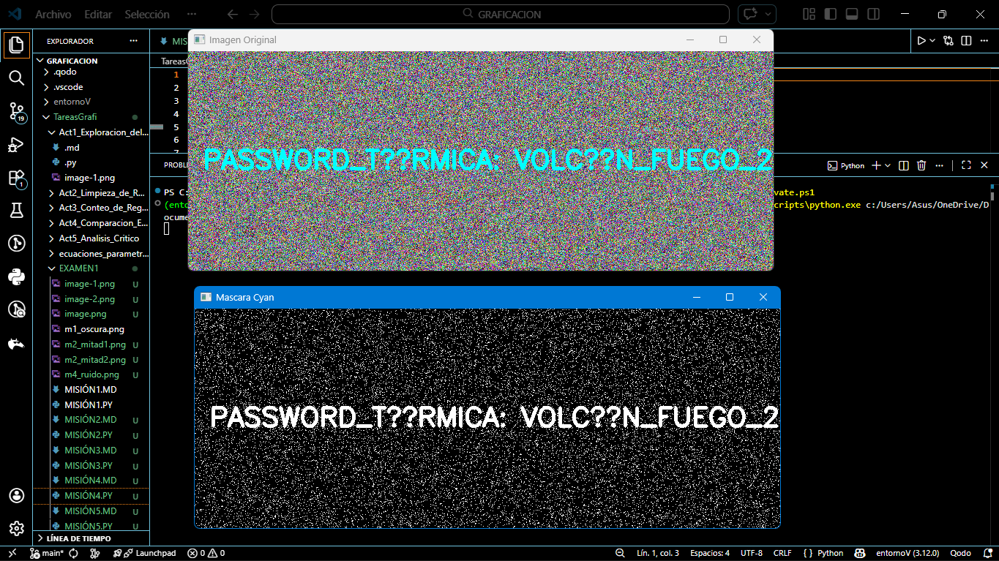

# Misión 4: La Frecuencia Térmica
---

# 1. Introducción
La contraseña está oculta en un mapa de ruido visual en color Cyan. El modelo HSV permite aislar colores independientemente de la iluminación.
---

# 2. Objetivo
Extraer la clave oculta aplicando segmentación por color en HSV.
---

# 3. Codigo
```python
import cv2
import numpy as np

# Leer la imagen del ruido
img = cv2.imread('C:\\Users\\Asus\\OneDrive\\Documentos\\GRAFICACION\\TareasGrafi\\EXAMEN1\\m4_ruido.png')
if img is None:
    print("Error al cargar la imagen")
    exit()  

# Convertir la imagen al espacio de color HSV
hsv = cv2.cvtColor(img, cv2.COLOR_BGR2HSV)

# Definir el rango para detectar cyan
lower_cyan = np.array([80, 100, 100])  # Hue ~90, rango bajo
upper_cyan = np.array([100, 255, 255]) # Hue ~90, rango alto

# Crear una máscara binaria
mask = cv2.inRange(hsv, lower_cyan, upper_cyan)

# Mostrar resultado
cv2.imshow("Imagen Original", img)
cv2.imshow("Mascara Cyan", mask)
cv2.waitKey(0)
cv2.destroyAllWindows()

# Guardar la mascara en el disco
cv2.imwrite("m4_mascara_cyan.png", mask)
```

---

# 4. Resultados
La máscara binaria elimina el ruido y revela la clave oculta.

---

# 5. Análisis
El rango HSV debe ajustarse cuidadosamente para evitar falsos positivos o pérdida de información.
---

# 6. Conclusión
El modelo HSV es ideal para segmentación basada en color en entornos con ruido.